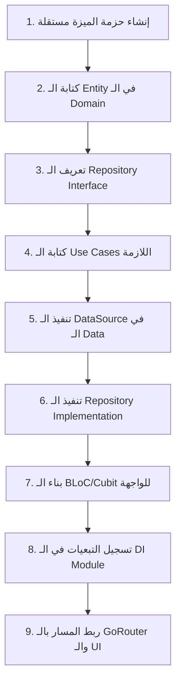

# دليل الاحتراف وأسئلة المقابلات للأسبوع الأول 🎓

هذا الدليل صُمم خصيصاً ليجعلك تفهم **"الـ فلسفة والـ كواليس"** خلف كل سطر كود تم كتابته، ويمنحك خوارزميات عمل ثابتة تطبقها في أي مشروع جديد، بالإضافة لأكثر أسئلة المقابلات شيوعاً للمناصب القيادية (Senior & Lead) مع أجوبتها النموذجية.

---

## 🗺️ القسم الأول: الخوارزميات الثابتة للعمل (The General Algorithms)

إليك "القوانين العامة" التي يجب حفظها وتطبيقها كخطوات متسلسلة عند بدء أي ميزة أو مشروع.

### 📜 1. الخوارزمية العامة لبناء أي ميزة من الصفر (Feature Building Algorithm)

إذا طلب منك العميل أو التيم ليد ميزة جديدة (مثلاً: ميزة السلة `feat_cart` أو الإشعارات `feat_notifications`)، اتبع هذا المخطط الذهني دائماً:



#### الخطوات التفصيلية (The Checklist):
1. **إنشاء الحزمة**: تحت مجلد `packages/features/` قم بإنشاء حزمة جديدة بملف `pubspec.yaml` يعتمد على حزم الـ `core`.
2. **طبقة الـ Domain (ابدأ بها دائماً - Domain First)**:
   * **الـ Entity**: كلاس Dart نقي (دون أي استيراد لـ Flutter) يمثل البيانات الأساسية التي تحتاجها الشاشة (مثال: `CartItem`).
   * **الـ Repository Contract**: واجهة برمجية (abstract class) يحدد العمليات المطلوبة (مثال: `Future<Either<Failure, List<CartItem>>> getCartItems()`).
   * **الـ Use Cases**: كلاس لكل عملية مستقلة يحتوي على دالة `call` فقط (مثال: `GetCartItemsUseCase`, `AddToCartUseCase`).
3. **طبقة الـ Data (الربط مع العالم الخارجي)**:
   * **الـ Model**: كلاس يرث الـ Entity ويحتوي على دوال الـ Serialization مثل `fromJson` و `toJson`.
   * **الـ Data Source**: واجهة وتنفيذ للاتصال بالشبكة (`RemoteDataSource` باستخدام `NetworkClient`) أو التخزين المحلي (`LocalDataSource` باستخدام `LocalStorage`).
   * **الـ Repository Implementation**: الكلاس الفعلي الذي يرث الـ Interface من طبقة الـ Domain، ويقوم باستدعاء الـ Data Source ومعالجة الأخطاء (catch) وإرجاع الـ `Failure` أو البيانات.
4. **طبقة الـ Presentation (إدارة الحالة والواجهة)**:
   * **الـ BLoC / Cubit**: إنشاء الـ Events والـ States والـ Bloc الخاص بالميزة.
   * **الـ UI**: بناء الـ Widgets والـ Pages التي تستمع وتتفاعل مع الـ Bloc.
5. **حقن التبعيات (DI Registration)**:
   * تسجيل الـ DataSource والـ Repository والـ UseCases والـ Bloc في ملف `di` الخاص بالحزمة.
6. **التوجيه (Routing)**:
   * إضافة الصفحة في ملف الـ Router الرئيسي ولفها بالـ `BlocProvider` المناسب.

---

### 📜 2. القانون العام لإدارة الحالة (State Management Recipe)

#### متى أستخدم BLoC ومتى أستخدم Cubit؟
* **Cubit**: للعمليات البسيطة ذات التدفق الأحادي (مثال: تشغيل الوضع الداكن، فتح القائمة الجانبية، عمليات الـ CRUD البسيطة دون تداخل).
* **BLoC**: للعمليات المعقدة التي تحتاج أحداثاً متعددة وتزامن، أو تحتاج تصفية وتعديل الأحداث قبل معالجتها (مثال: كتابة البحث الفوري، عمليات الرفع والتحميل المتزامنة، تدفق البيانات اللحظي).

#### الخوارزمية الثابتة لكتابة BLoC/Cubit:
1. **تصميم الـ States (الحالات)**: فكر أولاً، ما هي الحالات التي ستمر بها الشاشة؟
   * دائماً ابدأ بـ: `InitialState` (البداية)، `LoadingState` (تحميل)، `SuccessState` (النجاح وتمرير البيانات)، `ErrorState` (الفشل وتمرير رسالة الخطأ).
2. **تصميم الـ Events (الأحداث - للـ BLoC فقط)**: ما هي الإجراءات التي سيقوم بها المستخدم؟ (مثال: `FetchDataEvent`, `RefreshDataEvent`).
3. **كتابة منطق الـ Bloc/Cubit**:
   * قم بحقن الـ UseCase في الـ Constructor.
   * استدعي الـ UseCase واستخدم دالة `fold` (من مكتبة dartz) للتعامل مع النتيجة:
     ```dart
     result.fold(
       (failure) => emit(ErrorState(failure.message)),
       (data) => emit(SuccessState(data)),
     );
     ```
4. **التحكم في التزامن (Concurrency Control)**:
   * هل الحدث حساس للنقرات المتكررة؟ أضف `transformer: droppable()` (مثل أزرار الدفع والتسجيل).
   * هل الحدث يحتاج إلغاء العمليات السابقة؟ أضف `transformer: restartable()` (مثل حقل البحث الفوري).

---

## 💬 القسم الثاني: بنك أسئلة المقابلات المتقدمة (Senior / Lead Interview Q&A)

إليك الأسئلة التي تطرح في المقابلات لتمييز المهندس العادي من المهندس الخبير (Senior/Team Lead) مع إجاباتها النموذجية والعميقة.

### ❓ س1: لماذا نصرّ على ألا تحتوي طبقة الـ Domain على أي استيراد (Import) لمكتبة Flutter أو أي مكتبة خارجية أخرى؟
* **الإجابة النموذجية**:
  "الـ Domain Layer تمثل قلب الأعمال الأساسي للتطبيق (Pure Business Logic & Rules). إذا قمنا باستيراد مكتبة Flutter أو مكتبات مثل Hive أو Dio داخلها، فإننا نربط منطق عمل الشركة بتقنيات قابلة للتغيير.
  تطبيق مبدأ **استقلالية الـ Domain** يعطينا فوائد هائلة:
  1. **سهولة عمل اختبارات برمجية (Unit Testing)**: يمكننا اختبار منطق الأعمال كاملاً في بيئة Dart نقية دون الحاجة لتشغيل محاكي أو الاعتماد على معمارية Flutter الرسومية.
  2. **سهولة الاستبدال (Flexibility)**: لو قررنا لاحقاً استبدال قاعدة بيانات التطبيق من Hive إلى Isar، أو استبدال مكتبة Dio بـ Http نقي، فلن نلمس سطراً واحداً في طبقة الـ Domain لأنها تعتمد على عقود (Interfaces) مجردة وليس على تنفيذ فعلي."

---

### ❓ س2: ما هو الفرق الجوهري بين Element Tree و Widget Tree و RenderObject Tree في فلاتر؟ وكيف تؤثر على الأداء؟
* **الإجابة النموذجية**:
  * **Widget Tree**: هي شجرة التكوين (Configuration Tree). الـ Widgets هي كائنات خفيفة الوزن جداً وغير قابلة للتعديل (`immutable`)، يتم إنشاؤها وتدميرها باستمرار مع كل فريم أو Rebuild دون التأثير على الأداء.
  * **Element Tree**: هي شجرة التحكم ودورة الحياة (Lifecycle Controller Tree). الـ Elements هي التي تربط الـ Widgets بالـ RenderObjects. تحتفظ بحالة العناصر وتعرف موضعها الفعلي في الشجرة، وهي ثابتة وتعيش طويلاً.
  * **RenderObject Tree**: هي شجرة الرسم الفعلي والحسابات الهندسية (Layout & Paint Tree). الـ RenderObjects هي الكائنات الثقيلة التي تقوم بحساب القياسات ورسم الأشكال على الشاشة.
  * **تأثير الأداء**:
    عند حدوث Rebuild، يقوم فلاتر بمقارنة الـ Widget الجديد بالـ Element القديم (باستخدام `runtimeType` والـ `key`). إذا كانا متطابقين، يقوم الـ Element فقط بتحديث البيانات الخاصة بالـ RenderObject دون الحاجة لإعادة إنشاء الـ RenderObject بالكامل أو إعادة حساب مقاسات الشاشة (Layout pass).
    لذلك، كـ Seniors، نحرص على استخدام `const constructors` لتجنب توليد كائنات Widgets جديدة، ونستخدم `RepaintBoundary` لمنع انتشار عمليات الرسم (Paint passes) في الأجزاء التي لا تحتاج إلى تحديث."

---

### ❓ س3: كيف تعمل مكتبة `GoRouter` مع الـ `StatefulShellRoute`؟ ولماذا نفضلها في تطبيقات الـ Enterprise؟
* **الإجابة النموذجية**:
  "الـ `StatefulShellRoute` توفر ميزة التصفح المتداخل متفرع الحالة (Stateful Nested Navigation). 
  في الطرق التقليدية للـ Bottom Navigation Bar، عند تنقل المستخدم بين التبويبات (Tabs)، يتم تدمير الصفحة السابقة وفقدان حالتها (مثلاً: لو كان المستخدم قد كتب في حقل نصي أو قام بعمل سكرول، فسيختفي كل شيء عند العودة).
  أما `StatefulShellRoute` فتقوم بإنشاء **IndexedStack** مستقل لكل فرع (Branch) بحيث يحتوي كل تبويب على الـ Navigator Stack الخاص به بالكامل.
  **لماذا نفضلها؟**
  1. **المحافظة على الحالة (State Preservation)**: توفر تجربة مستخدم ممتازة عبر الحفاظ على حالة وتدفق كل صفحة عند التنقل والعودة.
  2. **دعم الـ Deep Linking المعقد**: تمكننا من توجيه المستخدم برابط مباشر إلى تبويب معين وداخل صفحة فرعية فيه مع بناء الـ Back Stack الخاص بهذا التبويب تلقائياً."

---

### ❓ س4: في الـ Clean Architecture، ما هي فائدة كلاس الـ UseCase؟ ولماذا لا نستدعي الـ Repository مباشرة في الـ BLoC؟
* **الإجابة النموذجية**:
  "استدعاء الـ Repository مباشرة في الـ BLoC يعتبر خرقاً لمبدأ المسؤولية الفردية (Single Responsibility Principle) ويعقد عملية التطوير في المشاريع الكبيرة للأسباب التالية:
  1. **تجنب التكرار (DRY Principle)**: لو كانت هناك عملية معينة (مثال: التحقق من صلاحية الجلسة أو تهيئة بيانات الدخول) يتم استدعاؤها في شاشة تسجيل الدخول وفي شاشة التحقق عند فتح التطبيق؛ لو قمنا بكتابتها داخل الـ BLoC سنكرر الكود. بوضعها في `UseCase` واحد، نضمن إعادة استخدامه في أي مكان.
  2. **الـ Documentation البرمجية**: كلاسات الـ UseCases تمثل قائمة الميزات التي يقدمها التطبيق (Features Checklist). بمجرد فتح مجلد الـ `usecases` يمكن لأي مطور جديد فهم ماذا يفعل هذا النظام بالضبط بمجرد قراءة أسماء الملفات.
  3. **سهولة التعديل**: لو تطلب منطق الدخول إضافة شرط جديد (مثلاً: التحقق من قبول الشروط والأحكام أولاً)، نقوم بتعديل الـ UseCase فقط، دون الحاجة لتعديل الـ BLoC أو الـ UI."

---

### ❓ س5: ما هو الـ Memory Leak في Flutter؟ وكيف نكشفه ونعالجه؟
* **الإجابة النموذجية**:
  "الـ Memory Leak يحدث عندما يحتفظ التطبيق بكائنات في الذاكرة (RAM) لم يعد بحاجة إليها، مما يمنع مجمع المهملات (Garbage Collector) من تحرير هذه الذاكرة. مع مرور الوقت، يتزايد استهلاك الذاكرة حتى ينهار التطبيق (Out of Memory Crash).
  **أسباب شائعة في Flutter**:
  1. نسيان إغلاق `StreamController` أو الـ `StreamSubscriptions`.
  2. نسيان عمل `dispose` للـ `TextEditingController`, `AnimationController`, أو `ScrollController`.
  3. ربط الـ Listeners بـ Object يعيش طويلاً (مثل Global Singleton) دون إلغائها.
  **كيفية الكشف والمعالجة**:
  * **الكشف**: نستخدم أداة **Flutter DevTools Memory Profiler**؛ نقوم بتتبع شجرة الذاكرة وعمل لقطة (Snapshot) ومقارنتها بلقطة أخرى بعد فتح وإغلاق الشاشة عدة مرات. إذا رأينا كلاسات الـ View أو الـ Controllers تزداد في العدد ولا تختفي، فهناك تسريب.
  * **المعالجة**: الالتزام الصارم بقانون الـ **Dispose**:
    ```dart
    @override
    void dispose() {
      _textController.dispose();
      _streamSubscription.cancel();
      super.dispose();
    }
    ```"

---

## 🏫 نصائح ذهبية لك لتكون تيم ليد ناجح ومدرس متميز:
1. **علم طلابك الـ "لماذا" قبل الـ "كيف"**: لا تقل لهم 'اكتبوا هكذا لأنها الطريقة الصحيحة'، بل قل لهم 'انظروا إلى هذه المشكلة في الكود التقليدي، وكيف يحلها هذا النمط البرمجي'. هذا يبني عقولاً برمجية وليس مجرد ناسخين للكود.
2. **استخدم التشبيهات الواقعية**:
   * شبه الـ **Interface** بـ "مقبس الكهرباء الجداري" (الكل يعرف شكله وكيف يستخدمه، لكن لا أحد يهتم بنوع الأسلاك خلف الجدار طالما أن الشاحن يعمل).
   * شبه الـ **BLoC** بـ "موظف الطلبات في المطعم" (الزبون يطلب منه، وهو يذهب للمطبخ ويعود بالطلب، دون أن يطبخ الزبون بنفسه أو يدخل المطبخ).
